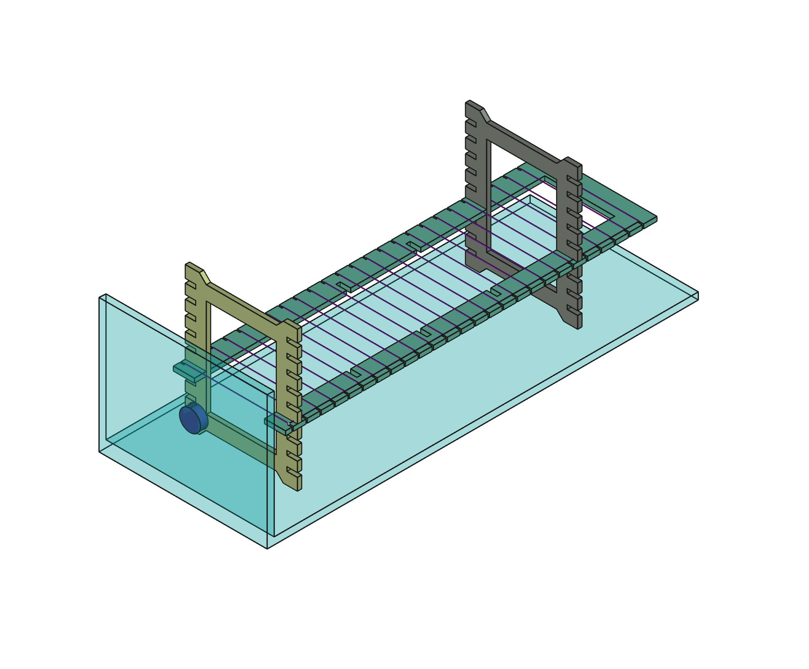
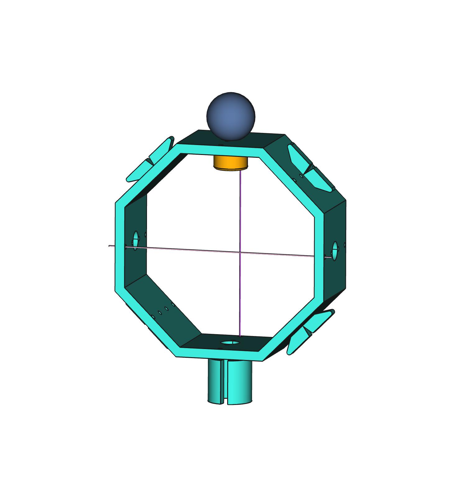

---

[

](http://www.echopen.org)

---

# echʘlab Target

This project is a set of ultrasound targets useful for various measurements in water-filled tanks.

Find source files here : https://github.com/echopen-foundation/echolab_target

Find documentation here : https://github.com/echopen-foundation/echolab_target/wiki

&nbsp;&nbsp;

---

